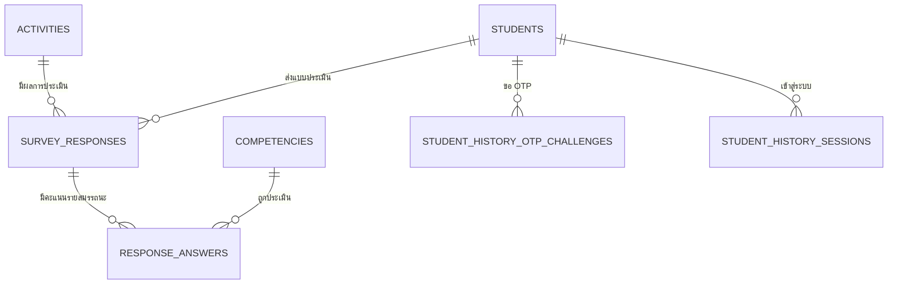

# คู่มือเชื่อมต่อหน้า User Portal

เอกสารนี้ส่งต่อให้ผู้พัฒนาหน้า **User (นักศึกษา)** ของระบบ SEDA เพื่อสร้างหน้าเข้าสู่ระบบและหน้าดูประวัติกิจกรรม/ผลการประเมิน โดยเชื่อมกับโครงสร้างปัจจุบันได้อย่างปลอดภัย

> ขอบเขตของหน้า User คือข้อมูลของนักศึกษาที่ล็อกอินอยู่เท่านั้น ห้ามใช้ API กลุ่ม `/api/students` หรือ API แอดมิน เพราะเป็นข้อมูลส่วนกลางและต้องใช้สิทธิ์ผู้ดูแลระบบ

## 1. สิ่งที่ระบบมีอยู่แล้ว

ระบบมีข้อมูลนักศึกษาจากการสแกน QR แล้ว ดังนี้

1. การสแกนครั้งแรก กรอกรหัสนักศึกษาและข้อมูลพื้นฐาน ได้แก่ ชื่อ-นามสกุล, สำนักวิชา, สาขา, ชั้นปี, อีเมล, เบอร์โทร และการยินยอม PDPA
2. การสแกนครั้งถัดไป ใช้เพียงรหัสนักศึกษา
3. นักศึกษาสามารถเข้า `/student/history` เพื่อยืนยันตัวตนด้วย **รหัสนักศึกษา + อีเมล + OTP 6 หลัก** แล้วดูประวัติการทำแบบประเมินและผลรายสมรรถนะได้

ดังนั้น สำหรับ User Portal เวอร์ชันแรก แนะนำให้ใช้ OTP เดิมเป็นระบบล็อกอิน ไม่ต้องสร้างรหัสผ่านใหม่ เพราะในฐานข้อมูล `students` **ยังไม่มี password hash** และ OTP ปลอดภัย/ดูแลง่ายกว่า

| ระบบ | วิธีเข้าสู่ระบบ | ใช้สำหรับ |
| --- | --- | --- |
| แอดมิน | อีเมล + รหัสผ่าน + cookie | จัดการกิจกรรมและข้อมูลทั้งระบบ |
| นักศึกษา (มีแล้ว) | รหัสนักศึกษา + อีเมล + OTP | ดูประวัติและผลของตนเอง |
| User Portal (ที่จะทำ) | ใช้ OTP เดิม | หน้าโปรไฟล์และกิจกรรมของตนเอง |

## 2. หน้าที่ควรมี

กำหนดเส้นทางใหม่ให้แยกจากหน้าผู้ดูแลอย่างชัดเจน

| เส้นทาง | หน้าที่ |
| --- | --- |
| `/user/login` | กรอกรหัสนักศึกษาและอีเมล ขอ/ยืนยัน OTP |
| `/user/activities` | รายการกิจกรรมที่นักศึกษาเคยทำแบบประเมิน |
| `/user/activities/:activityId` | รายละเอียดกิจกรรม, สถานะ PRE/POST และผลที่เกี่ยวข้อง |
| `/user/profile` | แสดงข้อมูลส่วนตัวที่ลงทะเบียนไว้ (ให้แก้ไขภายหลังได้เมื่อมี API รองรับ) |

สามารถใช้ `/student/history` เดิมเป็นต้นแบบหรือย้าย UI ไปที่ `/user/login` ได้ แต่ต้องคงการตรวจสอบ session ฝั่งเซิร์ฟเวอร์ไว้

## 3. ความสัมพันธ์ของข้อมูล



ตารางหลักที่หน้า User ต้องรู้มีดังนี้

| ตาราง | หน้าที่ | คอลัมน์สำคัญ |
| --- | --- | --- |
| `students` | โปรไฟล์นักศึกษา | `id`, `student_code`, `first_name`, `last_name`, `email`, `faculty`, `major`, `education_level`, `study_year`, `phone`, `pdpa_consented_at` |
| `activities` | รายละเอียดกิจกรรม | `id`, `code`, `name`, `detail`, `location`, `cover_image_data`, `start_date`, `end_date`, `status`, `participant_limit` |
| `survey_responses` | หลักฐานว่าทำแบบประเมินกิจกรรมแล้ว | `id`, `activity_id`, `student_id`, `phase`, `submitted_at` |
| `response_answers` | คะแนนคำตอบรายสมรรถนะ | `response_id`, `competency_id`, `score` (1-7) |
| `competencies` | ชื่อสมรรถนะ | `id`, `code`, `name`, `display_order` |
| `student_history_otp_challenges` | OTP แบบใช้ครั้งเดียว | `student_id`, `otp_hash`, `expires_at`, `failed_attempts`, `used_at` |
| `student_history_sessions` | session นักศึกษาหลังยืนยัน OTP | `student_id`, `token_hash`, `expires_at` |

ไม่ควรเพิ่มตาราง `participants` หรือ `activity_participants` สำหรับหน้าผู้ใช้ในตอนนี้ เพราะข้อมูลการเข้าร่วมจริงของระบบผูกอยู่ที่ `survey_responses` และ `students` แล้ว

## 4. API ที่ใช้งานได้ทันที

API ต่อไปนี้มีอยู่แล้วใน `server/src/routes/studentHistory.ts` และไม่ต้องใช้ cookie แอดมิน

### ขอ OTP

`POST /api/student-history/request-otp`

```json
{
  "studentCode": "B1234567",
  "email": "student@example.com"
}
```

ตอบกลับ `202` เสมอเพื่อไม่เปิดเผยว่ามีอีเมล/รหัสนี้ในระบบหรือไม่

```json
{
  "message": "หากข้อมูลที่ระบุตรงกับระบบ เราได้ส่งรหัสยืนยันไปยังอีเมลแล้ว"
}
```

### ยืนยัน OTP (Login)

`POST /api/student-history/verify-otp`

```json
{
  "studentCode": "B1234567",
  "email": "student@example.com",
  "otp": "123456"
}
```

```json
{
  "historySession": "64-character-random-hex-token",
  "expiresAt": "2026-08-16T10:30:00.000Z"
}
```

เก็บ `historySession` และ `expiresAt` ใน `sessionStorage` เท่านั้น ไม่เก็บใน `localStorage` และไม่ใส่ token ใน URL

### ดึงรายการประวัติ

`GET /api/student-history`

ต้องส่ง header:

```http
X-Student-History-Session: <historySession>
```

```ts
type StudentHistoryItem = {
  responseId: number
  activityId: number
  activityCode: string | null
  activityName: string
  activityStatus: string
  phase: 'pre' | 'post'
  status: 'submitted'
  submittedAt: string
}
```

### ดึงผลการประเมินหนึ่งรายการ

`GET /api/student-history/responses/:responseId`

ส่ง `X-Student-History-Session` เช่นเดียวกัน โดยเซิร์ฟเวอร์จะตรวจว่าผลนั้นเป็นของนักศึกษาที่ล็อกอินอยู่ก่อนเสมอ

```ts
type StudentHistoryResponse = StudentHistoryItem & {
  competencies: Array<{
    competencyId: number
    name: string
    displayOrder: number
    levelValue: number
  }>
}
```

> ห้ามเรียก `GET /api/students`, `GET /api/students/:id` หรือ `GET /api/students/:id/responses` จากหน้า User: ทั้งหมดเป็น API แอดมินและต้องมี admin cookie

## 5. TypeScript ที่แนะนำสำหรับหน้า User

ให้สร้างไฟล์ เช่น `src/features/user-portal/types.ts` หรือรวมไว้ใน `src/lib/api.ts` ตามรูปแบบโปรเจกต์เดิม

```ts
export type UserPortalSession = {
  historySession: string
  expiresAt: string
}

export type UserProfile = {
  studentCode: string
  firstName: string
  lastName: string
  email: string
  faculty: string | null
  major: string | null
  educationLevel: string | null
  studyYear: number | null
  phone: string | null
}

export type JoinedActivity = {
  activityId: number
  activityCode: string | null
  name: string
  detail: string | null
  location: string | null
  imageData: string | null
  startDate: string | null
  endDate: string | null
  activityStatus: 'draft' | 'active' | 'closed' | 'archived'
  preResponse: { responseId: number; submittedAt: string } | null
  postResponse: { responseId: number; submittedAt: string } | null
}

export type UserActivityDetail = JoinedActivity & {
  results: StudentHistoryResponse[]
}
```

ตัวอย่าง service ที่เรียกของเดิม (ฟังก์ชัน `requestStudentHistoryOtp`, `verifyStudentHistoryOtp`, `getStudentHistory`, `getStudentHistoryResponse` มีอยู่แล้วใน `src/lib/api.ts`):

```ts
export async function getUserActivities(session: UserPortalSession) {
  const { history } = await getStudentHistory(session.historySession)

  // API เดิมส่งแยก PRE/POST จึงรวมเป็นการ์ดกิจกรรมในหน้าเว็บได้ชั่วคราว
  return Object.values(history.reduce<Record<number, {
    activityId: number
    activityCode: string | null
    name: string
    activityStatus: string
    preResponse: StudentHistoryItem | null
    postResponse: StudentHistoryItem | null
  }>>((result, item) => {
    const group = result[item.activityId] ?? {
      activityId: item.activityId,
      activityCode: item.activityCode,
      name: item.activityName,
      activityStatus: item.activityStatus,
      preResponse: null,
      postResponse: null,
    }
    group[item.phase === 'pre' ? 'preResponse' : 'postResponse'] = item
    result[item.activityId] = group
    return result
  }, {}))
}
```

## 6. API เพิ่มเติมที่ควรให้ฝั่งเซิร์ฟเวอร์ทำ

API เดิมเพียงพอสำหรับ “รายการประวัติการประเมิน” แต่ยังไม่ส่งรายละเอียดกิจกรรม เช่น สถานที่, รายละเอียด, วันที่จัด และรูปปก จึงแนะนำเพิ่ม router ใหม่ `server/src/routes/studentPortal.ts` และ mount ที่ `/api/student-portal`

| Method / path | ใช้ทำอะไร | การตอบกลับ |
| --- | --- | --- |
| `GET /api/student-portal/me` | แสดงโปรไฟล์ของผู้ล็อกอิน | `{ profile: UserProfile }` |
| `GET /api/student-portal/activities` | แสดงกิจกรรมที่เคยเข้าร่วมแบบรวม PRE/POST | `{ activities: JoinedActivity[] }` |
| `GET /api/student-portal/activities/:activityId` | รายละเอียดกิจกรรมและผลของตนเอง | `{ activity: UserActivityDetail }` |

ทุก endpoint ต้องอ่าน header `X-Student-History-Session`, ตรวจ session ผ่านฟังก์ชันเดียวกับ `requireHistorySession()` ใน `studentHistory.ts` และใช้ `studentId` ที่ได้จาก session เป็นเงื่อนไข query เสมอ

ตัวอย่าง query สำหรับรายการกิจกรรม (ใช้ parameter binding `?` เท่านั้น):

```sql
SELECT
  a.id AS activity_id,
  a.code AS activity_code,
  a.name,
  a.detail,
  a.location,
  a.cover_image_data,
  a.start_date,
  a.end_date,
  a.status AS activity_status,
  MAX(CASE WHEN sr.phase = 'pre' THEN sr.id END) AS pre_response_id,
  MAX(CASE WHEN sr.phase = 'pre' THEN sr.submitted_at END) AS pre_submitted_at,
  MAX(CASE WHEN sr.phase = 'post' THEN sr.id END) AS post_response_id,
  MAX(CASE WHEN sr.phase = 'post' THEN sr.submitted_at END) AS post_submitted_at
FROM survey_responses sr
JOIN activities a ON a.id = sr.activity_id
WHERE sr.student_id = ?
GROUP BY a.id
ORDER BY COALESCE(a.start_date, DATE(sr.submitted_at)) DESC, a.id DESC;
```

ตัวอย่าง guard ที่ควรแยกใช้ร่วมกัน:

```ts
export async function requireStudentPortalSession(rawSession: string) {
  const session = historySessionSchema.parse(rawSession)
  const rows = await pool.query<Array<{ student_id: number }>>(
    `SELECT student_id
     FROM student_history_sessions
     WHERE token_hash = ? AND expires_at > NOW()
     LIMIT 1`,
    [hash(session)],
  )
  if (!rows[0]) throw new ApiError(401, 'เซสชันหมดอายุ กรุณาเข้าสู่ระบบใหม่')
  return Number(rows[0].student_id)
}
```

ควรย้าย helper `hash`, schema ของ token และ `requireHistorySession` ออกจาก `studentHistory.ts` ไปเป็นไฟล์ร่วม เช่น `server/src/lib/studentSession.ts` ก่อนสร้าง router ใหม่ เพื่อไม่เขียน logic สำคัญซ้ำ

## 7. โครงสร้างไฟล์ที่แนะนำ

```text
src/
  components/student/
    StudentHistoryPage.tsx          # ของเดิม: ใช้เป็นต้นแบบ OTP
    studentHistorySession.ts        # ของเดิม: เก็บ sessionStorage
  features/user-portal/
    UserLoginPage.tsx
    UserActivitiesPage.tsx
    UserActivityDetailPage.tsx
    UserProfilePage.tsx
    types.ts
    userPortalApi.ts
server/src/
  lib/studentSession.ts             # helper ตรวจ OTP session ที่ใช้ร่วมกัน
  routes/studentHistory.ts          # ของเดิม
  routes/studentPortal.ts           # API ใหม่สำหรับ User Portal
```

ใน `src/App.tsx` เพิ่ม route ของ `/user/*` ก่อนส่วนตรวจ session ของแอดมิน เพื่อไม่ให้ User Portal ถูกส่งไป `/admin/login`

## 8. เงื่อนไขความปลอดภัยที่ต้องทำ

1. แยก session นักศึกษาออกจาก admin cookie โดยสิ้นเชิง
2. ใช้ข้อมูล `student_id` จาก session ที่เซิร์ฟเวอร์ตรวจสอบแล้วเท่านั้น ห้ามรับ `studentId` จาก body, query หรือ path เพื่อเลือกข้อมูล
3. คำสั่งดูผลต้องมีเงื่อนไข `WHERE sr.id = ? AND sr.student_id = ?` เสมอ
4. ใช้ prepared statement (`?`) ทุก query ห้ามต่อ string จากข้อมูลผู้ใช้เป็น SQL
5. เก็บ token ใน `sessionStorage`; เมื่อหมดอายุหรือ API ตอบ `401` ให้ลบ token แล้วกลับหน้า `/user/login`
6. OTP มีอายุ 10 นาที, session มีอายุ 30 นาที, จำกัดการขอและยืนยันไม่เกิน 5 ครั้งต่อ 15 นาทีอยู่แล้ว ต้องคงไว้
7. ห้าม log ค่า OTP, session token, อีเมลเต็ม หรือเบอร์โทรใน console/analytics
8. แสดงเฉพาะข้อมูลที่จำเป็นต่อผู้ใช้ และใส่ข้อความเกี่ยวกับ PDPA เมื่อเปิดหน้าโปรไฟล์

## 9. หากต้องการใช้รหัสผ่านจริงในอนาคต

ยัง **ไม่จำเป็น** สำหรับงานแรก หากมีนโยบายให้มีบัญชี/รหัสผ่านนักศึกษาจริง ให้เพิ่มตารางใหม่แทนการใส่รหัสผ่านลง `students`

```sql
CREATE TABLE student_auth_accounts (
  id BIGINT UNSIGNED AUTO_INCREMENT PRIMARY KEY,
  student_id BIGINT UNSIGNED NOT NULL UNIQUE,
  password_hash VARCHAR(255) NOT NULL,
  is_active BOOLEAN NOT NULL DEFAULT TRUE,
  email_verified_at DATETIME NULL,
  session_version INT UNSIGNED NOT NULL DEFAULT 1,
  last_login_at DATETIME NULL,
  created_at TIMESTAMP NOT NULL DEFAULT CURRENT_TIMESTAMP,
  updated_at TIMESTAMP NOT NULL DEFAULT CURRENT_TIMESTAMP ON UPDATE CURRENT_TIMESTAMP,
  CONSTRAINT fk_student_auth_student
    FOREIGN KEY (student_id) REFERENCES students(id) ON DELETE CASCADE
) ENGINE=InnoDB DEFAULT CHARSET=utf8mb4;
```

ใช้ Argon2id หรือ bcrypt เพื่อ hash รหัสผ่านเท่านั้น ห้ามเก็บ plain-text password และควรทำ email verification, password reset token, rate limit และ session revocation เพิ่มก่อนเปิดใช้งานจริง

## 10. Checklist ส่งมอบงาน

- [ ] หน้า `/user/login` ใช้ OTP API เดิมและเก็บ session ด้วย `studentHistorySession.ts`
- [ ] หน้า `/user/activities` เรียกประวัติของผู้ล็อกอินเท่านั้น
- [ ] การ์ดหนึ่งใบแทนหนึ่งกิจกรรม รวมสถานะ PRE/POST ไว้ในการ์ดเดียว
- [ ] หน้า `/user/activities/:activityId` ไม่เปิดผลของ activity หรือ response ที่ไม่ใช่ของผู้ล็อกอิน
- [ ] เพิ่ม `studentPortal.ts` สำหรับข้อมูลรายละเอียดกิจกรรมและโปรไฟล์ หากต้องใช้ฟิลด์มากกว่า API ประวัติเดิม
- [ ] เพิ่ม route `/user/*` ใน `src/App.tsx` โดยไม่แตะ flow `/admin/*`
- [ ] ทดสอบ: ใช้นักศึกษา A เปิด URL ของ response นักศึกษา B ต้องตอบ `404` หรือ `401`
- [ ] ทดสอบ: ลบ/หมดอายุ token แล้วหน้า User ต้องบังคับยืนยัน OTP ใหม่

## 11. ไฟล์อ้างอิงในโปรเจกต์

- `src/user/components/student/StudentHistoryPage.tsx` — UI/flow OTP และรายการผลเดิม
- `src/user/components/student/studentHistorySession.ts` — การเก็บและล้าง session ที่หมดอายุ
- `src/lib/api.ts` — type และ API client ที่มีอยู่แล้ว
- `server/src/routes/studentHistory.ts` — การตรวจ OTP/session และ query ที่ scope ตาม student
- `server/src/db/schema.ts` — schema และ migration ของตารางทั้งหมด
- `server/src/routes/students.ts` — รูปแบบข้อมูลนักศึกษา (ใช้เป็นข้อมูลอ้างอิงเท่านั้น; router นี้เป็น admin-only)

