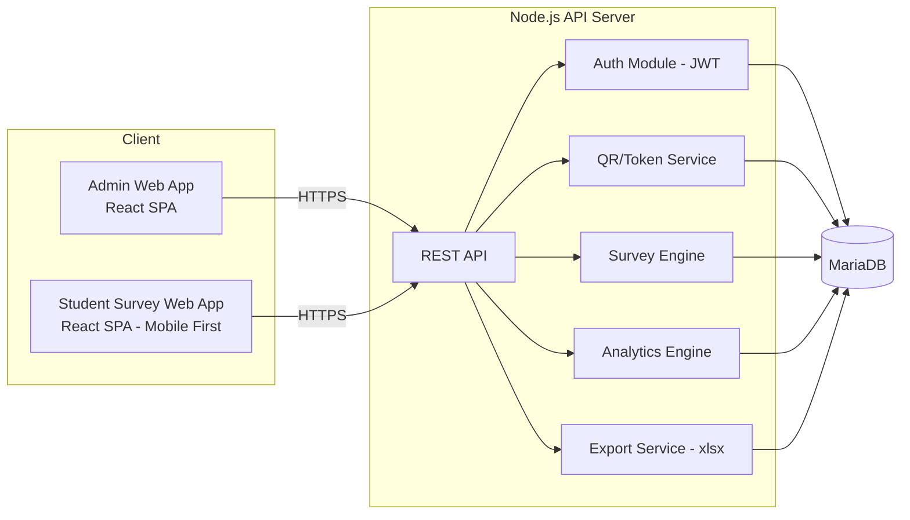
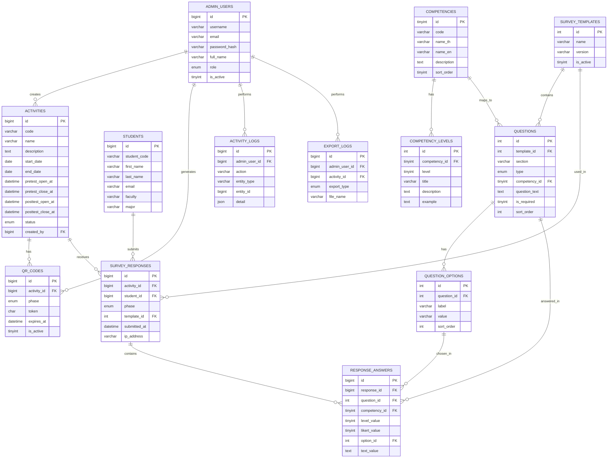
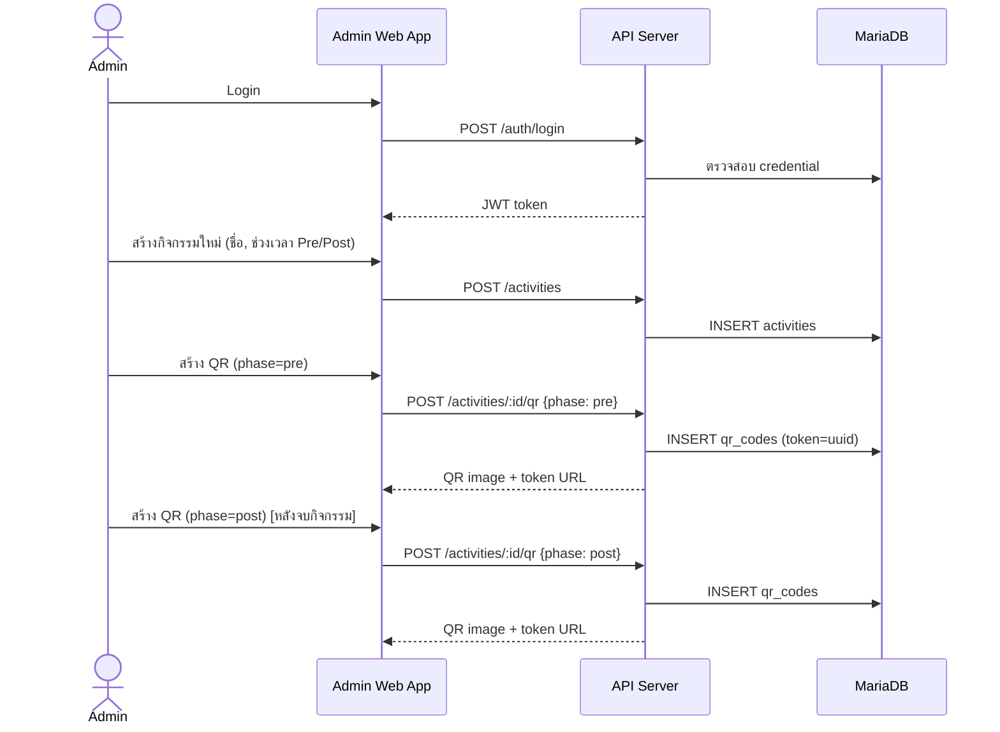
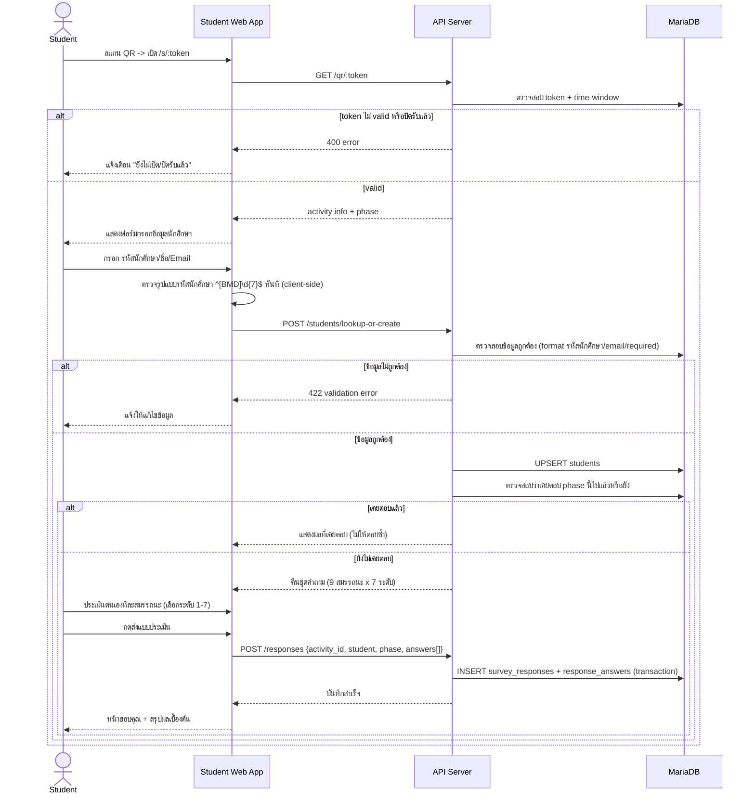
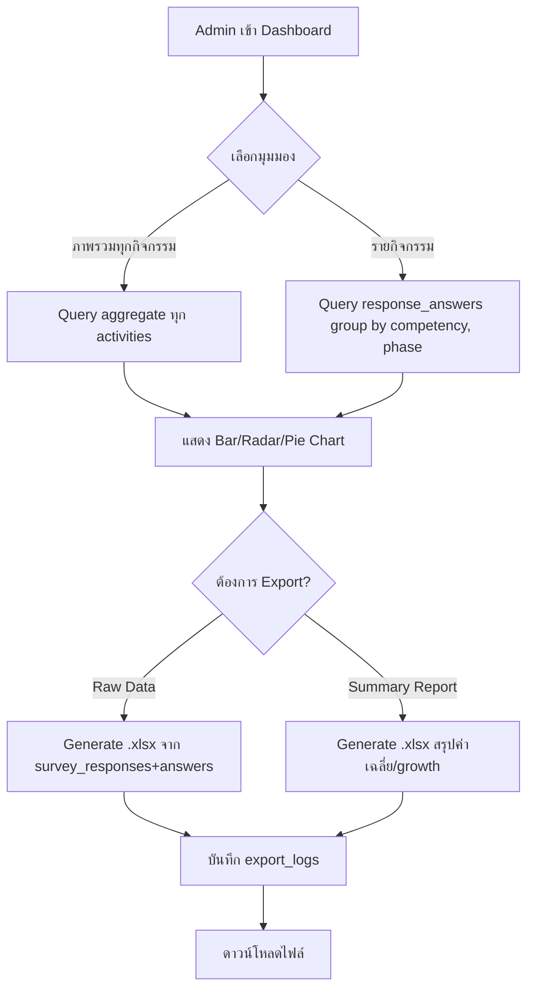

# System Design Document
## ระบบประเมินและติดตามผลกิจกรรมส่งเสริมผู้ประกอบการ (SEDA Activity Evaluation System)

- เอกสารอ้างอิง: `PRD - SEDA Activity Evaluation System.txt`, `System Flow.pdf`, `แบบประเมินสมรรถะด้านความเป็นผู้ประกอบการ.docx`
- เวอร์ชันเอกสาร: 0.1 (Draft สำหรับตรวจสอบ)
- จัดทำโดย: Claude (ผู้ช่วยพัฒนา) ร่วมกับคุณธนพล คงเจริญสุข

---

## 1. Tech Stack

| ส่วน | เทคโนโลยี |
|---|---|
| Frontend | React + Vite + Tailwind CSS |
| Backend | Node.js (แนะนำ Express หรือ Fastify) |
| Database | MariaDB |
| Auth (Admin) | JWT (access + refresh token) |
| Auth (Student) | ไม่ใช้รหัสผ่าน — ระบุตัวตนผ่าน รหัสนักศึกษา + Email ต่อการทำแบบสอบถามแต่ละครั้ง (ดู [7. ประเด็นที่ต้องตัดสินใจ](#7-ประเด็นที่ต้องตัดสินใจก่อนเริ่มพัฒนา)) |
| QR Code | `qrcode` (Node) generate ฝั่ง backend, เก็บเป็น token อ้างอิงกิจกรรม+phase |
| Export | `exceljs` สำหรับ Export .xlsx |
| ORM/Query | แนะนำ Prisma หรือ Knex (type-safe, migration versioning ง่าย) |

---

## 2. Architecture Overview



---

## 3. Roles & Permissions

| Role | สิทธิ์ |
|---|---|
| **Super Admin** | ทุกสิทธิ์ของ Staff + จัดการบัญชี Admin/Staff |
| **SEDA Staff/Admin** | จัดการกิจกรรม, จัดการชุดคำถามมาตรฐาน, สร้าง/ควบคุม QR + เวลาเปิดปิด, ดู Dashboard, Export ข้อมูล |
| **Student** | ไม่มีบัญชี — เข้าถึงเฉพาะกิจกรรม/phase ที่สแกน QR มา, ทำแบบประเมิน, ดูผล/ประวัติของตนเอง (ผ่าน student_code + email) |

---

## 4. ฟีเจอร์และฟังก์ชันที่ต้องพัฒนา

### 4.1 โมดูล Authentication & User Management (Admin)
- Login / Logout (JWT)
- จัดการบัญชี Staff (CRUD) — เฉพาะ Super Admin
- Reset Password / เปลี่ยนรหัสผ่าน
- บันทึก Audit Log การ login และการกระทำสำคัญ (PDPA)

### 4.2 โมดูลจัดการกิจกรรม (Event Management)
- สร้าง/แก้ไข/ลบ (soft delete) กิจกรรม: ชื่อ, รายละเอียด, สถานที่, ช่วงวันที่จัดกิจกรรม
- ตั้งค่าช่วงเวลาเปิด-ปิดรับคำตอบ **แยกกัน** สำหรับ Pre-test และ Post-test (วันที่+เวลา)
- สถานะกิจกรรม: `draft` → `active` → `closed` → `archived`
- ระบบปิดรับคำตอบอัตโนมัติเมื่อพ้นเวลาที่กำหนด (ตรวจสอบที่ backend ทุก request ไม่พึ่ง cron อย่างเดียว)
- รายการกิจกรรมทั้งหมด พร้อม filter/search และสถานะจำนวนผู้ตอบ Pre/Post

### 4.3 โมดูล QR Code
- สร้าง QR Code แยกตาม phase (`pre` / `post`) ต่อกิจกรรม โดยอ้างอิง token (UUID) ที่ผูกกับ `activity_id` + `phase`
- Endpoint public: `GET /s/:token` → resolve เป็นกิจกรรม+phase แล้ว redirect เข้าแบบฟอร์ม
- ตรวจสอบ token: valid, อยู่ใน time-window ที่เปิดอยู่หรือไม่ → ถ้าไม่ใช่ แสดงหน้าแจ้งเตือน ("ยังไม่เปิด" / "ปิดรับแล้ว")
- รองรับการสร้าง QR ใหม่ (regenerate) แต่ยังคง track ประวัติ token เก่า (audit)
- ดาวน์โหลด QR เป็นไฟล์ภาพ (PNG) เพื่อนำไปพิมพ์/แสดงจอโปรเจกเตอร์

### 4.4 โมดูลจัดการคลังคำถามมาตรฐาน (Standardized Survey/Question Bank)
- จัดการ **9 สมรรถนะ** ตามกรอบ IMPACTS3 (ชื่อ, คำนิยาม) — แก้ไขได้โดย Admin
- จัดการ **7 ระดับ** ต่อสมรรถนะ (ชื่อระดับ, คำอธิบายพฤติกรรม, ตัวอย่าง) — แก้ไขได้โดย Admin
- จัดการคำถามเสริมประเภทอื่น: Likert 1-5, Multiple Choice, ข้อคิดเห็นเพิ่มเติม (text) — เผื่ออนาคต
- เนื่องจากระบบระบุ "Single Survey Template" — เก็บเป็น `is_active` template เดียว แต่โครงสร้างรองรับหลาย version เพื่อย้อนดูข้อมูลเก่าได้ถ้ามีการแก้ไขคำถามในอนาคต โดยไม่กระทบข้อมูลที่ตอบไปแล้ว

### 4.5 โมดูลสำหรับนักศึกษา (Student Survey Portal)
- หน้า Landing หลังสแกน QR: กรอก/ยืนยันข้อมูลนักศึกษา (ชื่อ-นามสกุล, รหัสนักศึกษา, Email)
  - ถ้าเคยมีข้อมูล (`student_code` ตรงกับที่เคยลงทะเบียน) → ดึงข้อมูลมาให้ยืนยัน
  - **Validation รหัสนักศึกษา**: ต้องขึ้นต้นด้วย `B`, `M`, หรือ `D` (ตัวพิมพ์ใหญ่ — normalize เป็น uppercase ก่อนตรวจ) ตามด้วยตัวเลข 7 หลัก รวม 8 ตัวอักษร เช่น `B6512345`
    - Regex: `^[BMD]\d{7}$`
    - ตรวจสอบทั้งฝั่ง Frontend (inline error ทันทีที่พิมพ์ผิดรูปแบบ) และฝั่ง Backend (กันการยิง API ตรงข้าม frontend)
    - คำนำหน้าสื่อระดับการศึกษา (เช่น B=ปริญญาตรี, M=โท, D=เอก) — ใช้เป็นข้อมูลเสริมสำหรับ filter บน Dashboard ได้ในอนาคต (เก็บแยกเป็น `education_level` คำนวณจากตัวอักษรแรกตอน insert ก็ได้ ไม่จำเป็นต้องมี column เพิ่ม)
  - Validation อื่น: รูปแบบ Email, required fields → ถ้าไม่ถูกต้องแจ้งเตือนให้กรอกใหม่ (ตรงกับ System Flow.pdf)
- หน้าแบบประเมินตนเอง (Self-Assessment Form):
  - แสดงทีละสมรรถนะ (9 ด้าน) พร้อมคำนิยาม และให้เลือกระดับ 1-7 (แสดงคำอธิบาย+ตัวอย่างของแต่ละระดับ ให้อ่านประกอบการเลือก)
  - Progress indicator (ทำไปกี่ข้อจาก 9)
  - Mobile-first, ปุ่มใหญ่ กดง่ายบนมือถือ
- ป้องกันการตอบซ้ำ: เช็ค unique (`activity_id`, `student_id`, `phase`) — ถ้าทำไปแล้วให้แสดงผลเดิม ไม่ให้ตอบซ้ำ
- หน้าสรุปผลหลังส่ง (Thank you + แสดงคะแนนเบื้องต้นของตนเอง เช่น radar chart รายบุคคล)
- หน้าประวัติการตอบแบบสอบถามของตนเอง (ค้นด้วย student_code + email)

**Responsive Design (ทุกหน้าในโมดูลนี้):**
- ออกแบบแบบ Mobile-first ด้วย Tailwind breakpoints — layout หลักทดสอบและปรับให้ใช้งานได้ดีที่ 3 ขนาดจอเป็นอย่างน้อย: Mobile (< 640px, `sm`), Tablet (640–1024px, `md`/`lg`), Desktop (≥ 1024px, `xl`)
- องค์ประกอบที่ต้อง responsive โดยเฉพาะ: การ์ดตัวเลือกระดับ 1-7 (เรียงเป็นคอลัมน์เดียวบนมือถือ, grid หลายคอลัมน์บนจอใหญ่), ฟอนต์/ปุ่มขนาดพอสัมผัสง่าย (touch target ≥ 44px), ฟอร์มกรอกข้อมูลนักศึกษาไม่ zoom เพี้ยนบน iOS (font-size ≥ 16px ใน input)
- ทดสอบผ่านเบราว์เซอร์บนมือถือจริง (ไม่ใช่แค่ DevTools) ก่อนปิด Phase 2 เนื่องจากผู้ตอบส่วนใหญ่จะสแกน QR ด้วยมือถือหน้างาน

### 4.6 โมดูลวิเคราะห์ข้อมูลและ Dashboard (Analytics & Reporting)
- Dashboard ภาพรวมทุกกิจกรรม: จำนวนผู้ตอบ Pre/Post, % completion, ค่าเฉลี่ยคะแนนรวม
- Dashboard รายกิจกรรม:
  - Bar Chart เปรียบเทียบคะแนนเฉลี่ยแต่ละสมรรถนะ Pre vs Post
  - Radar Chart แสดงภาพรวม 9 สมรรถนะ Pre vs Post (ซ้อนกัน 2 เส้น)
  - Pie Chart สัดส่วนผู้เข้าร่วม (เช่น ตามคณะ/ระดับการศึกษา ถ้ามีข้อมูล)
  - ตารางคะแนนรายบุคคล + growth (Post - Pre) ต่อสมรรถนะ
- คำนวณ Growth Score อัตโนมัติ: `avg(post.level) - avg(pre.level)` ต่อสมรรถนะ/ต่อกิจกรรม/ภาพรวมทั้งระบบ
- Filter ตามช่วงวันที่, กิจกรรม, คณะ

### 4.7 โมดูล Export
- Export Raw Data เป็น `.xlsx` (รายคำตอบทั้งหมด รวม Pre/Post link กันด้วย student_code)
- Export รายงานสรุปเชิงบริหาร (.xlsx) — ค่าเฉลี่ยต่อสมรรถนะ, growth, จำนวนผู้เข้าร่วม
- บันทึก export_logs (ใครส่งออกเมื่อไหร่ กิจกรรมไหน) เพื่อ accountability ตาม PDPA

### 4.8 Non-Functional / Cross-cutting
- Rate limiting บน endpoint public (`/s/:token`, submit answer) กันสแกนสแปม
- Input validation ทุกจุดรับข้อมูลจาก Student (สคีมาเดียวกับ frontend/backend เช่นใช้ zod)
- HTTPS only, CORS restricted
- PDPA: consent checkbox ก่อนกรอกข้อมูลส่วนตัว, การเก็บ log การเข้าถึง/ส่งออกข้อมูล, สิทธิ์เข้าถึงข้อมูลตาม role

---

## 5. Database Schema (MariaDB)

### 5.1 ER Diagram



### 5.2 DDL รายละเอียด

```sql
-- ==========================================
-- 1. Admin / Staff Accounts
-- ==========================================
CREATE TABLE admin_users (
    id              BIGINT UNSIGNED AUTO_INCREMENT PRIMARY KEY,
    username        VARCHAR(50)  NOT NULL UNIQUE,
    email           VARCHAR(255) NOT NULL UNIQUE,
    password_hash   VARCHAR(255) NOT NULL,
    full_name       VARCHAR(150) NOT NULL,
    role            ENUM('super_admin','staff') NOT NULL DEFAULT 'staff',
    is_active       TINYINT(1)   NOT NULL DEFAULT 1,
    last_login_at   DATETIME     NULL,
    created_at      TIMESTAMP    NOT NULL DEFAULT CURRENT_TIMESTAMP,
    updated_at      TIMESTAMP    NOT NULL DEFAULT CURRENT_TIMESTAMP ON UPDATE CURRENT_TIMESTAMP
) ENGINE=InnoDB;

-- ==========================================
-- 2. Students (master, unique identifier = student_code)
-- ==========================================
CREATE TABLE students (
    id              BIGINT UNSIGNED AUTO_INCREMENT PRIMARY KEY,
    student_code    VARCHAR(8)   NOT NULL UNIQUE,  -- รูปแบบ [B|M|D] + เลข 7 หลัก เช่น B6512345 (บังคับด้วย CHECK + validation ฝั่ง app)
    first_name      VARCHAR(100) NOT NULL,
    last_name       VARCHAR(100) NOT NULL,
    email           VARCHAR(255) NOT NULL,
    faculty         VARCHAR(150) NULL,
    major           VARCHAR(150) NULL,
    phone           VARCHAR(20)  NULL,
    consent_pdpa_at DATETIME     NULL,
    created_at      TIMESTAMP    NOT NULL DEFAULT CURRENT_TIMESTAMP,
    updated_at      TIMESTAMP    NOT NULL DEFAULT CURRENT_TIMESTAMP ON UPDATE CURRENT_TIMESTAMP,
    INDEX idx_students_email (email),
    CONSTRAINT chk_students_student_code CHECK (student_code REGEXP '^[BMD][0-9]{7}$')  -- ต้องการ MariaDB 10.2+
) ENGINE=InnoDB;

-- ==========================================
-- 3. Activities (กิจกรรม)
-- ==========================================
CREATE TABLE activities (
    id                  BIGINT UNSIGNED AUTO_INCREMENT PRIMARY KEY,
    code                VARCHAR(30)  NOT NULL UNIQUE,
    name                VARCHAR(255) NOT NULL,
    description         TEXT         NULL,
    location            VARCHAR(255) NULL,
    start_date          DATE         NULL,
    end_date            DATE         NULL,
    pretest_open_at     DATETIME     NULL,
    pretest_close_at    DATETIME     NULL,
    posttest_open_at    DATETIME     NULL,
    posttest_close_at   DATETIME     NULL,
    status              ENUM('draft','active','closed','archived') NOT NULL DEFAULT 'draft',
    created_by          BIGINT UNSIGNED NOT NULL,
    created_at          TIMESTAMP    NOT NULL DEFAULT CURRENT_TIMESTAMP,
    updated_at          TIMESTAMP    NOT NULL DEFAULT CURRENT_TIMESTAMP ON UPDATE CURRENT_TIMESTAMP,
    CONSTRAINT fk_activities_created_by FOREIGN KEY (created_by) REFERENCES admin_users(id),
    INDEX idx_activities_status (status)
) ENGINE=InnoDB;

-- ==========================================
-- 4. QR Codes (แยกตาม phase)
-- ==========================================
CREATE TABLE qr_codes (
    id              BIGINT UNSIGNED AUTO_INCREMENT PRIMARY KEY,
    activity_id     BIGINT UNSIGNED NOT NULL,
    phase           ENUM('pre','post') NOT NULL,
    token           CHAR(36) NOT NULL UNIQUE,
    is_active       TINYINT(1) NOT NULL DEFAULT 1,
    expires_at      DATETIME NULL,
    created_by      BIGINT UNSIGNED NOT NULL,
    created_at      TIMESTAMP NOT NULL DEFAULT CURRENT_TIMESTAMP,
    CONSTRAINT fk_qr_activity FOREIGN KEY (activity_id) REFERENCES activities(id),
    CONSTRAINT fk_qr_created_by FOREIGN KEY (created_by) REFERENCES admin_users(id),
    INDEX idx_qr_activity_phase (activity_id, phase, is_active)
) ENGINE=InnoDB;

-- ==========================================
-- 5. Survey Template (versioning, single active template)
-- ==========================================
CREATE TABLE survey_templates (
    id          INT UNSIGNED AUTO_INCREMENT PRIMARY KEY,
    name        VARCHAR(150) NOT NULL,
    version     VARCHAR(20)  NOT NULL,
    is_active   TINYINT(1)   NOT NULL DEFAULT 0,
    created_at  TIMESTAMP    NOT NULL DEFAULT CURRENT_TIMESTAMP
) ENGINE=InnoDB;

-- ==========================================
-- 6. Competencies (9 ด้าน ตามกรอบ IMPACTS3)
-- ==========================================
CREATE TABLE competencies (
    id          TINYINT UNSIGNED AUTO_INCREMENT PRIMARY KEY,
    code        VARCHAR(10)  NOT NULL UNIQUE,
    name_th     VARCHAR(255) NOT NULL,
    name_en     VARCHAR(255) NOT NULL,
    description TEXT         NULL,
    sort_order  TINYINT UNSIGNED NOT NULL DEFAULT 0,
    is_active   TINYINT(1)   NOT NULL DEFAULT 1
) ENGINE=InnoDB;

-- ==========================================
-- 7. Competency Levels (7 ระดับต่อสมรรถนะ)
-- ==========================================
CREATE TABLE competency_levels (
    id              INT UNSIGNED AUTO_INCREMENT PRIMARY KEY,
    competency_id   TINYINT UNSIGNED NOT NULL,
    level           TINYINT UNSIGNED NOT NULL,   -- 1-7
    title           VARCHAR(100) NOT NULL,       -- เช่น "ตระหนักรู้"
    description     TEXT NOT NULL,
    example         TEXT NULL,
    CONSTRAINT fk_levels_competency FOREIGN KEY (competency_id) REFERENCES competencies(id),
    UNIQUE KEY uq_competency_level (competency_id, level)
) ENGINE=InnoDB;

-- ==========================================
-- 8. Questions (คลังคำถามมาตรฐาน - รองรับหลายประเภท)
-- ==========================================
CREATE TABLE questions (
    id              INT UNSIGNED AUTO_INCREMENT PRIMARY KEY,
    template_id     INT UNSIGNED NOT NULL,
    section         VARCHAR(150) NULL,
    type            ENUM('competency_scale','likert','multiple_choice','text') NOT NULL,
    competency_id   TINYINT UNSIGNED NULL,   -- ใช้เมื่อ type = competency_scale
    question_text   TEXT NULL,               -- ใช้เมื่อ type = likert/multiple_choice/text
    likert_min      TINYINT NULL,
    likert_max      TINYINT NULL,
    likert_min_label VARCHAR(100) NULL,
    likert_max_label VARCHAR(100) NULL,
    is_required     TINYINT(1) NOT NULL DEFAULT 1,
    sort_order      INT NOT NULL DEFAULT 0,
    is_active       TINYINT(1) NOT NULL DEFAULT 1,
    created_at      TIMESTAMP NOT NULL DEFAULT CURRENT_TIMESTAMP,
    updated_at      TIMESTAMP NOT NULL DEFAULT CURRENT_TIMESTAMP ON UPDATE CURRENT_TIMESTAMP,
    CONSTRAINT fk_questions_template FOREIGN KEY (template_id) REFERENCES survey_templates(id),
    CONSTRAINT fk_questions_competency FOREIGN KEY (competency_id) REFERENCES competencies(id),
    INDEX idx_questions_template (template_id, sort_order)
) ENGINE=InnoDB;

-- ==========================================
-- 9. Question Options (สำหรับ multiple_choice)
-- ==========================================
CREATE TABLE question_options (
    id          INT UNSIGNED AUTO_INCREMENT PRIMARY KEY,
    question_id INT UNSIGNED NOT NULL,
    label       VARCHAR(255) NOT NULL,
    value       VARCHAR(100) NOT NULL,
    sort_order  INT NOT NULL DEFAULT 0,
    CONSTRAINT fk_options_question FOREIGN KEY (question_id) REFERENCES questions(id)
) ENGINE=InnoDB;

-- ==========================================
-- 10. Survey Responses (1 record ต่อ นักศึกษา+กิจกรรม+phase)
-- ==========================================
CREATE TABLE survey_responses (
    id              BIGINT UNSIGNED AUTO_INCREMENT PRIMARY KEY,
    activity_id     BIGINT UNSIGNED NOT NULL,
    student_id      BIGINT UNSIGNED NOT NULL,
    phase           ENUM('pre','post') NOT NULL,
    template_id     INT UNSIGNED NOT NULL,
    submitted_at    DATETIME NOT NULL,
    ip_address      VARCHAR(45) NULL,
    user_agent      VARCHAR(255) NULL,
    CONSTRAINT fk_responses_activity FOREIGN KEY (activity_id) REFERENCES activities(id),
    CONSTRAINT fk_responses_student FOREIGN KEY (student_id) REFERENCES students(id),
    CONSTRAINT fk_responses_template FOREIGN KEY (template_id) REFERENCES survey_templates(id),
    UNIQUE KEY uq_response_once (activity_id, student_id, phase),  -- กันตอบซ้ำ
    INDEX idx_responses_activity_phase (activity_id, phase)
) ENGINE=InnoDB;

-- ==========================================
-- 11. Response Answers
-- ==========================================
CREATE TABLE response_answers (
    id              BIGINT UNSIGNED AUTO_INCREMENT PRIMARY KEY,
    response_id     BIGINT UNSIGNED NOT NULL,
    question_id     INT UNSIGNED NOT NULL,
    competency_id   TINYINT UNSIGNED NULL,   -- denormalized สำหรับ query เร็วขึ้น
    level_value     TINYINT NULL,            -- 1-7 (competency_scale)
    likert_value    TINYINT NULL,            -- 1-5 (likert)
    option_id       INT UNSIGNED NULL,       -- multiple_choice
    text_value      TEXT NULL,               -- text
    created_at      TIMESTAMP NOT NULL DEFAULT CURRENT_TIMESTAMP,
    CONSTRAINT fk_answers_response FOREIGN KEY (response_id) REFERENCES survey_responses(id) ON DELETE CASCADE,
    CONSTRAINT fk_answers_question FOREIGN KEY (question_id) REFERENCES questions(id),
    CONSTRAINT fk_answers_option FOREIGN KEY (option_id) REFERENCES question_options(id),
    INDEX idx_answers_response (response_id),
    INDEX idx_answers_competency (competency_id)
) ENGINE=InnoDB;

-- ==========================================
-- 12. Audit Log (PDPA / Security)
-- ==========================================
CREATE TABLE activity_logs (
    id              BIGINT UNSIGNED AUTO_INCREMENT PRIMARY KEY,
    admin_user_id   BIGINT UNSIGNED NULL,
    action          VARCHAR(100) NOT NULL,
    entity_type     VARCHAR(50)  NOT NULL,
    entity_id       BIGINT UNSIGNED NULL,
    detail          JSON NULL,
    ip_address      VARCHAR(45) NULL,
    created_at      TIMESTAMP NOT NULL DEFAULT CURRENT_TIMESTAMP,
    CONSTRAINT fk_logs_admin FOREIGN KEY (admin_user_id) REFERENCES admin_users(id)
) ENGINE=InnoDB;

-- ==========================================
-- 13. Export Log (accountability)
-- ==========================================
CREATE TABLE export_logs (
    id              BIGINT UNSIGNED AUTO_INCREMENT PRIMARY KEY,
    admin_user_id   BIGINT UNSIGNED NOT NULL,
    activity_id     BIGINT UNSIGNED NULL,
    export_type     ENUM('raw_excel','summary_report') NOT NULL,
    file_name       VARCHAR(255) NOT NULL,
    created_at      TIMESTAMP NOT NULL DEFAULT CURRENT_TIMESTAMP,
    CONSTRAINT fk_export_admin FOREIGN KEY (admin_user_id) REFERENCES admin_users(id),
    CONSTRAINT fk_export_activity FOREIGN KEY (activity_id) REFERENCES activities(id)
) ENGINE=InnoDB;
```

### 5.3 หมายเหตุการออกแบบ

- **`response_answers.competency_id`** เป็น denormalized field (คัดลอกจาก `questions.competency_id`) เพื่อให้ query คำนวณคะแนนเฉลี่ยต่อสมรรถนะได้เร็วโดยไม่ต้อง join ตาราง `questions` ทุกครั้ง — trade-off ที่คุ้มค่าเพราะ analytics query จะถูกเรียกบ่อยบน Dashboard
- **Unique key `(activity_id, student_id, phase)`** บนตาราง `survey_responses` คือกลไกหลักที่ทำให้ตรง NFR "Data Integrity เชื่อมโยง Pre/Post ผ่าน Unique Identifier" และป้องกันการตอบซ้ำ
- แยก `qr_codes` ออกจาก `activities` (ไม่ผูก token ตรงกับ id กิจกรรม) เพื่อไม่ให้เดา URL กิจกรรมอื่นได้ง่าย (token เป็น UUID) และรองรับการ regenerate QR โดยไม่กระทบ token เก่า
- ตาราง `competencies` + `competency_levels` แยกจาก `questions` เพราะคำนิยามสมรรถนะและคำอธิบายระดับเป็น "ข้อมูลอ้างอิง" ที่ไม่เปลี่ยนบ่อย ส่วน `questions` คือสิ่งที่ผูกกับ template ที่ใช้จริงในการตอบแบบสอบถามแต่ละเวอร์ชัน

---

## 6. System Flow

### 6.1 Flow ฝั่ง Admin: สร้างกิจกรรม + QR



### 6.2 Flow ฝั่งนักศึกษา: ทำแบบประเมิน (ใช้ได้ทั้ง Pre และ Post)



### 6.3 Flow ฝั่ง Admin: Dashboard & Export



---

## 7. ประเด็นที่ต้องตัดสินใจก่อนเริ่มพัฒนา

เอกสารต้นฉบับ 3 ไฟล์มีจุดที่ **ขัดแย้งกันเล็กน้อย** ผมออกแบบ schema ให้ยืดหยุ่นรองรับได้ทั้งสองทาง แต่อยากให้ช่วยยืนยันก่อนลงมือพัฒนาจริง:

1. **Scale การประเมิน**: PRD ระบุ "Likert Scale 1-5" แต่แบบฟอร์มจริง (.docx) ใช้ **สเกล 1-7 ระดับ ตามกรอบ IMPACTS3** (9 สมรรถนะ) พร้อมคำอธิบาย+ตัวอย่างในแต่ละระดับ
   → ผมออกแบบ schema โดยยึดตาม **แบบฟอร์มจริง (1-7)** เป็นหลัก และเผื่อโครงสร้างสำหรับ Likert 1-5/Multiple Choice ไว้ใช้เป็นคำถามเสริม ถูกต้องตามที่ต้องการหรือไม่?

2. **การยืนยันตัวตนนักศึกษา**: PRD กล่าวถึง "Student เข้าสู่ระบบ" (login) แต่ System Flow.pdf แสดงการ **สแกน QR แล้วกรอกข้อมูลใหม่ทุกครั้ง โดยไม่มี login/password**
   → ผมออกแบบตาม System Flow.pdf (ไม่มี password, ระบุตัวตนด้วย รหัสนักศึกษา+Email) เพราะ friction ต่ำกว่าเหมาะกับการสแกนหน้างาน แต่ถ้าต้องการให้นักศึกษาดู "ประวัติการตอบแบบสอบถามของตนเอง" ได้แบบปลอดภัยกว่านี้ อาจต้องเพิ่มระบบ OTP ทาง Email หรือ Magic Link — ต้องการให้เพิ่มส่วนนี้หรือไม่?

3. **การลงทะเบียนกิจกรรมล่วงหน้า**: ระบบต้องมีรายชื่อนักศึกษาที่ "ลงทะเบียน" กิจกรรมไว้ล่วงหน้า (upload รายชื่อ) หรือเปิดให้ใครก็ได้ที่สแกน QR กรอกข้อมูลเข้าร่วมได้เลย (ตามที่ diagram แสดง)?

4. **QR Regenerate**: ถ้า Admin สร้าง QR ใหม่ซ้ำสำหรับ phase เดิม ต้องการให้ token เก่าใช้ไม่ได้ทันที หรือใช้ได้จนกว่าจะหมดเวลา (ผมออกแบบให้ยกเลิก token เก่าอัตโนมัติเมื่อสร้างใหม่)?

---

## 8. Roadmap Mapping (อ้างอิง PRD ข้อ 8)

| Phase | ขอบเขตในเอกสารนี้ |
|---|---|
| Phase 1: Requirements & DB Design | เอกสารนี้ทั้งหมด (รอ Admin ยืนยันข้อ 7) |
| Phase 2: UI/UX + Core Survey Engine | โมดูล 4.2–4.5 |
| Phase 3: Analytics Dashboard & Export | โมดูล 4.6–4.7 |
| Phase 4: Integration, UAT, Training | ทดสอบ end-to-end ตาม flow ข้อ 6 |
| Phase 5: Production Deployment | Deploy + handover |
